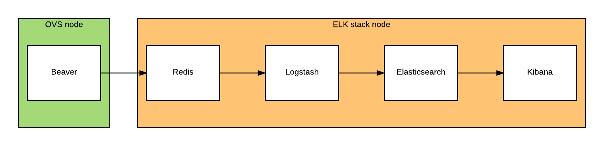
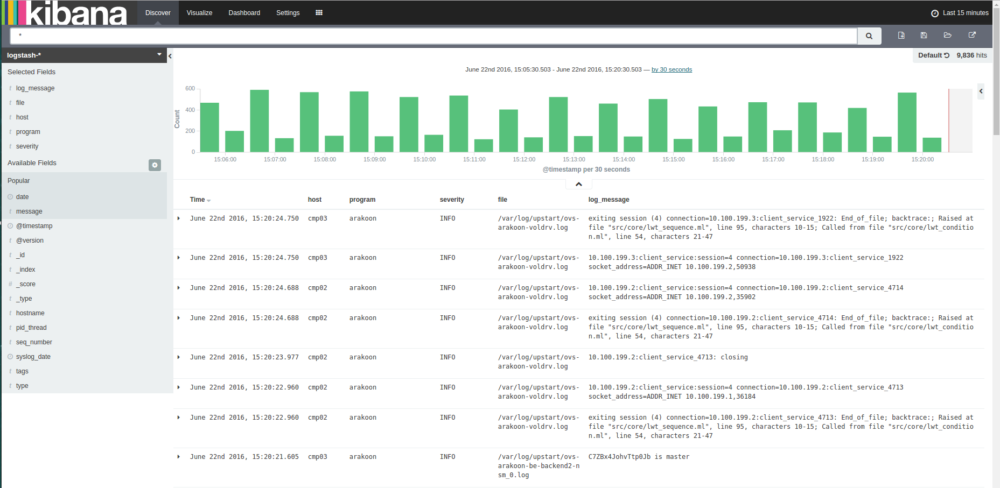
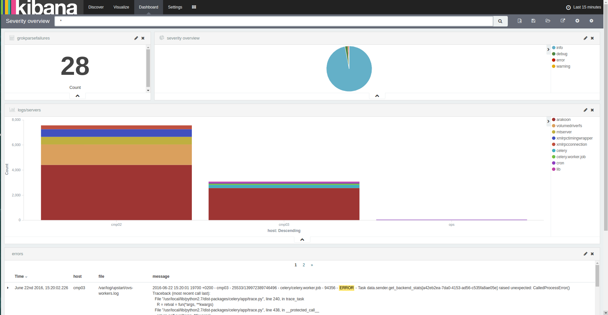

# OVS logging

To be able to bring some visibility to an OVS installation, we opted to run an ELK stack to gather logging information and centralise all this information into a single viewing pane.

## What is an ELK stack?

An ELK-stack consists of 3 open source components:

* Elasticsearch: a NoSQL database, based on Apache's Lucene engine, which will keep track of all of our log files
* Logstash: a log pipeline tool that accepts various inputs and targets. In our case, it will read logging from a redis queue and store them into elasticsearch
* Kibana: a visualisation tool on top of elasticsearch

In our case, we'll be adding 2 extra components to fetch the logging from all OVS nodes and put them into Redis. Logstash will consume the redis queue and store the log messages into elasticsearch.

## Components

* [Beaver](docs/beaver.md)
* [Redis](docs/redis.md)
* [Logstash](docs/logstash.md)
* [Elasticsearch](docs/elasticsearch.md)
* [Kibana](docs/kibana.md)