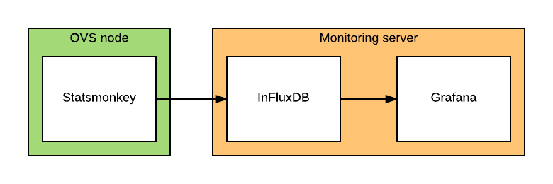

# Open vStorage Statistics

We'll be using Grafana to generate graphs and statistics on our OVS clusters. A custom written script will gather statistics from all available components and push them into InfluxDB. Grafana will use the data available in InfluxDB to present graphs to the user.

The flow between main components:

## Components

* [Statsmonkey](docs/statsmonkey.md)
* [InfluxDB](docs/influxdb.md)
* [Grafana](docs/grafana.md)

